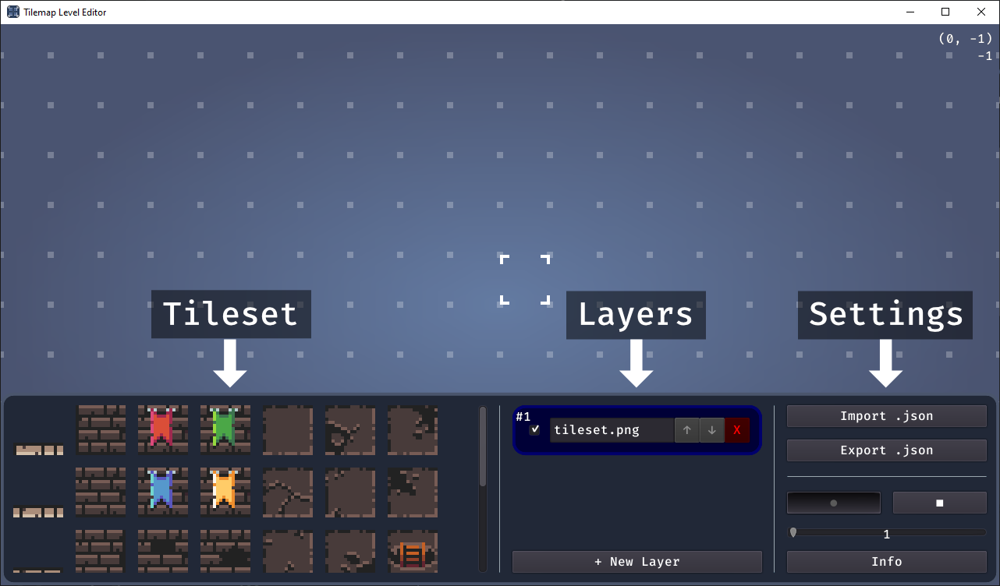
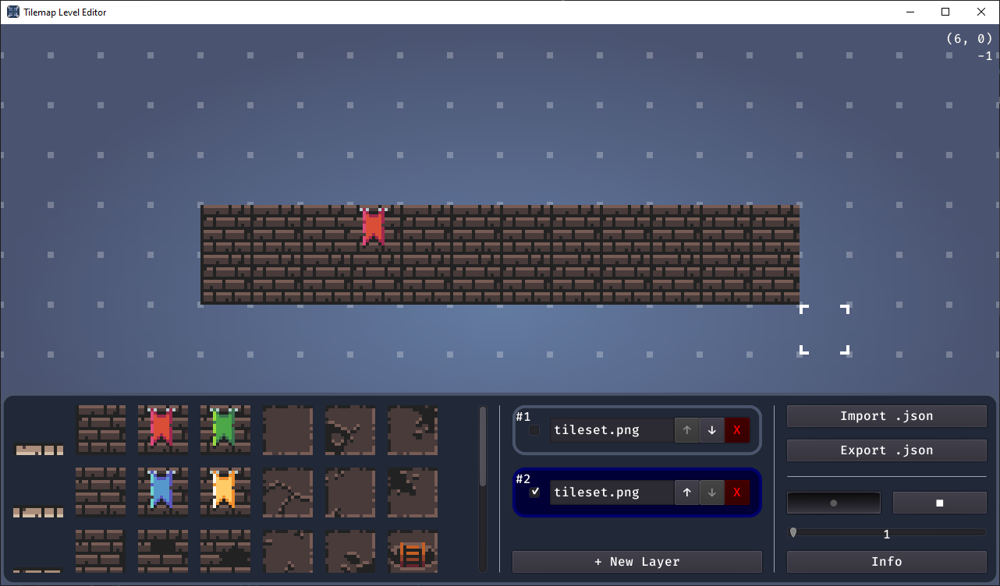

# Tilemap Level Editor


Open source simple level editor for Godot with JSON export functionality. Made with Godot.

[](https://ko-fi.com/E1E5CVWWE)

- [Github Project](https://github.com/arcaneenergy/tilemap-level-editor)
- [YouTube](https://www.youtube.com/c/ArcaneEnergy)
- [Website](https://arcaneenergy.github.io/)


---

## Download

Download the exported program on itch.io.

[**itch.io download link**](https://arcaneenergy.itch.io/tilemap-level-editor)

## Use case

This is currently used in a personal project. It's used to load in JSON files into Godot to recreate the levels at runtime. The exported JSON file contains all levels and individual cells. This makes it easy to recreate the level in Godot.

Alternatively, you can use this program to easily create levels in the editor.

## UI Overview

Create new layers with the `+ New Layer` button. This brings up a dialog box for selecting an image file. After selecting a file, the new layer appears in the list.

Switch between layers by pressing the arrow to the left of the layer. This will open the tileset on the left. Use the up and down arrow keys to move layers.



Select a tile and start drawing.



Change the size and shape of the cursor using the buttons in the lower right corner.


## Exported JSON file

The exported JSON file looks like this:

```json
[
    {
        "texture_path": "tilemap-level-editor/tileset.png",
        "cells": [
            [2,-6,-1],
            [2,-5,-1]
        ]
    },
    {
        "texture_path": "tilemap-level-editor/tileset.png",
        "cells": [
            [4,-7,-2],
            [4,-6,-2]
        ]
    }
]
```

Each cell contains an ID, an x and a y position. The ID is used to identify which cell in the tileset it refers to.

Godot_v3.5-rc2
